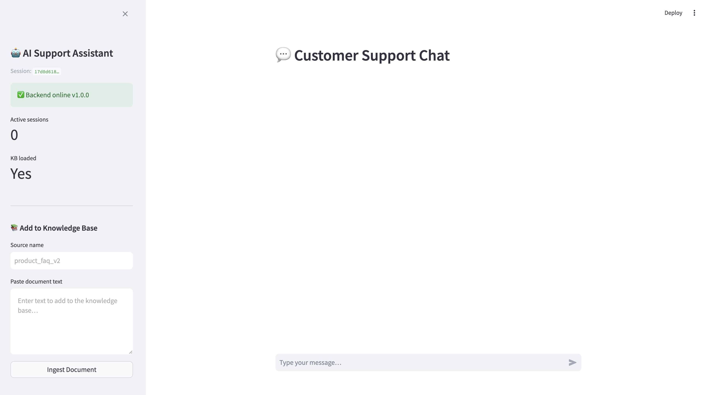

# Supermarket Sales Analytics Dashboard

An interactive multi-supermarket analytics platform built with **Streamlit**, **Plotly**, **pandas**, and **SQLite**. Upload sales CSVs for up to three supermarkets and explore revenue trends, customer behaviour, competitor comparisons, AI-generated insights, revenue forecasts, and raw SQL queries — all in one browser-based dashboard.

---

## Problem Statement

Retail analysts typically export data to spreadsheets and build static charts manually. This workflow is slow, error-prone, and makes cross-site comparison difficult. This project replaces that process with a fully automated pipeline that ingests raw transaction CSVs, standardises column formats, loads data into a relational store, and renders a live multi-tab dashboard with business intelligence features suitable for operational decision-making.

---

## Solution Approach

Raw CSV files from one or more supermarkets are loaded and standardised through a centralised data service. Column names are normalised, date and time fields are parsed, and derived columns (hour of sale, day of week, month) are computed. The clean data is persisted to SQLite and exposed to the dashboard layer through a set of analytics and charting services. All business logic is isolated in the `services/` layer, keeping the Streamlit UI thin and testable.

---

## Features

**Overview Tab**
- Total revenue, transaction count, average basket size, and average customer rating KPIs
- Per-supermarket snapshot table with key headline metrics
- Revenue and basket size comparison across all loaded supermarkets

**Comparison Tab**
- Side-by-side revenue by branch and by product line
- Market share distribution and revenue gap analysis between supermarkets
- Operational and customer-behaviour comparisons (payment method, gender, customer type)

**Insights Tab**
- Anomaly detection — flags sales periods that deviate significantly from trend
- Cohort analysis — repeat-visit behaviour by customer segment
- Profit margin breakdown by product category
- Top and bottom performing product lines ranked by revenue

**Forecast Tab**
- Monthly revenue forecast with confidence intervals using linear trend extrapolation

**SQL Runner Tab**
- Execute arbitrary SQL queries directly against the SQLite database from the browser
- Pre-loaded example queries covering common business intelligence tasks

**Data Layer**
- Accepts CSV upload of one or more supermarket files in the Streamlit sidebar
- Alternatively, loads pre-ingested data from the SQLite database
- Supports the three included datasets out of the box (Supermarket A, B, C)

---

## Tech Stack

| Layer | Technology |
|---|---|
| Frontend / UI | Streamlit |
| Visualisation | Plotly |
| Data processing | pandas, numpy, scipy |
| Machine learning | scikit-learn (forecasting, anomaly detection) |
| Database | SQLite via sqlite-utils |
| Configuration | `config/settings.py` (no API keys required) |
| Testing | pytest |
| Notebook | Jupyter |

---

## Architecture

```
DATA SOURCES
  data/raw/supermarket_sales.csv           — Supermarket A (primary dataset)
  data/raw/supermarket_sales_competitor.csv  — Supermarket B
  data/raw/supermarket_sales_competitor_2.csv — Supermarket C
  synthetic data/supermarket_sales_synthetic.csv — Extended synthetic dataset
        │
        ▼
DATA PIPELINE  (services/data_loader.py)
  standardise_columns()   — rename headers to canonical schema
  parse date / time → sale_date, sale_time, hour, day_of_week, month
  validate required columns and numeric types
  persist to SQLite (supermarket_sales.db)
        │
        ▼
SERVICES LAYER
  services/analytics.py   — KPIs, benchmarks, forecast, anomaly detection,
                            cohort analysis, profit margin, top/bottom ranking
  services/charts.py      — Plotly chart builders (bar, line, pie, scatter)
  services/insights.py    — Natural-language insight generation
  services/data_loader.py — load_from_database(), load_from_uploads(), run_sql()
        │
        ▼
UTILITIES
  utils/filters.py        — apply_filters() — date range, branch, product line
  utils/formatting.py     — format_currency(), format_number(), format_percentage()
  utils/logger.py         — get_logger() — rotating file handler → logs/
  config/settings.py      — paths, constants, colour palette, schema definition
        │
        ▼
STREAMLIT DASHBOARD  (app/dashboard.py)
  5 tabs: Overview · Comparison · Insights · Forecast · SQL Runner
```

---

## Project Structure

```
Supermarket Sales Analytics Dashboard/
├── app/
│   └── dashboard.py              # Streamlit application entry point
├── services/
│   ├── __init__.py
│   ├── analytics.py              # KPIs, forecasting, anomaly detection, cohort
│   ├── charts.py                 # Plotly chart builders
│   ├── data_loader.py            # CSV ingestion, DB reads, SQL runner
│   └── insights.py               # Insight text generation
├── config/
│   ├── __init__.py
│   └── settings.py               # Paths, column schemas, colour palette
├── utils/
│   ├── __init__.py
│   ├── filters.py                # DataFrame filter helpers
│   ├── formatting.py             # Currency and number formatters
│   └── logger.py                 # Rotating file logger
├── src/
│   ├── analysis.py               # Standalone analysis scripts
│   ├── load_data.py              # CLI entry point → forwards to services/data_loader
│   └── utils.py                  # Shared utilities
├── sql/
│   ├── schema.sql                # Database schema definition
│   ├── load_data.sql             # Data load statements
│   ├── advanced_queries.sql      # Business intelligence SQL examples
│   ├── business_data.sql         # Supplementary business queries
│   └── README.md                 # SQL module notes
├── data/
│   ├── raw/
│   │   ├── supermarket_sales.csv
│   │   ├── supermarket_sales_competitor.csv
│   │   └── supermarket_sales_competitor_2.csv
│   └── processed/                # Reserved for feature-enriched exports
├── synthetic data/
│   ├── supermarket_sales_data_dictionary.txt   # Column definitions
│   ├── supermarket_sales_synthetic.csv         # Extended synthetic dataset
│   └── supermarket_sales_synthetic.xlsx        # Same dataset in Excel format
├── notebooks/
│   └── sales_eda.ipynb           # Exploratory data analysis notebook
├── outputs/
│   ├── charts/                   # Exported chart images
│   └── reports/                  # Generated report files
├── tests/
│   ├── __init__.py
│   └── test_analytics.py         # Unit tests for analytics service
├── logs/
│   └── dashboard.log             # Runtime application log
├── supermarket_sales.db          # SQLite database (auto-created on first load)
├── requirements.txt
└── README.md
```

---

## Dataset

Three real-format CSV files are included in `data/raw/`:

| File | Label | Description |
|---|---|---|
| `supermarket_sales.csv` | Supermarket A | Primary dataset — transactions across branches |
| `supermarket_sales_competitor.csv` | Supermarket B | Competitor dataset for comparison |
| `supermarket_sales_competitor_2.csv` | Supermarket C | Second competitor dataset |

Each file contains: `Invoice ID`, `Branch`, `City`, `Customer type`, `Gender`, `Product line`, `Unit price`, `Quantity`, `Tax 5%`, `Total`, `Date`, `Time`, `Payment`, `cogs`, `gross margin percentage`, `gross income`, `Rating`.

A column-level data dictionary is available in `synthetic data/supermarket_sales_data_dictionary.txt`.

An extended synthetic dataset (`synthetic data/supermarket_sales_synthetic.csv` and `.xlsx`) with additional records is available for testing at larger volumes.

---

## Setup Instructions

### Prerequisites

- Python 3.10+
- No API keys required

### 1. Clone the repository

```bash
git clone <repo-url>
cd "Supermarket Sales Analytics Dashboard"
```

### 2. Create and activate a virtual environment

```bash
python -m venv venv
source venv/bin/activate        # Windows: venv\Scripts\activate
```

### 3. Install dependencies

```bash
pip install -r requirements.txt
```

---

## How to Run

### Option A — Upload CSV files via the dashboard (recommended for first use)

```bash
streamlit run app/dashboard.py
```

Open [http://localhost:8501](http://localhost:8501). In the sidebar, select **Upload CSVs**, upload one or more files from `data/raw/`, and the dashboard will load immediately.

### Option B — Pre-load data into SQLite, then run the dashboard

```bash
# Ingest the raw CSVs into the SQLite database
python src/load_data.py

# Launch the dashboard
streamlit run app/dashboard.py
```

Select **Load from Database** in the sidebar to use the pre-ingested data.

### Run the EDA notebook

```bash
jupyter notebook notebooks/sales_eda.ipynb
```

### Run tests

```bash
pytest tests/ -v
```

---

## Example Usage

**Explore the Overview tab** — upload all three CSVs and compare headline KPIs side-by-side across Supermarket A, B, and C.

**Identify underperforming product lines** — use the Comparison tab to view revenue by product line across sites.

**Detect anomalous sales periods** — open the Insights tab to see which dates deviate significantly from the rolling trend.

**Forecast next month's revenue** — the Forecast tab plots a linear trend with confidence intervals based on monthly historical revenue.

**Run a custom query:**

```sql
SELECT product_line, SUM(total) AS revenue, COUNT(*) AS transactions
FROM sales
GROUP BY product_line
ORDER BY revenue DESC;
```

Enter this in the SQL Runner tab and click **Run** to see the result in a sortable table.

---

## Key Engineering Decisions

**Services / utils / config separation** keeps the Streamlit UI layer free of business logic. `app/dashboard.py` only calls service functions and renders results. All analytics, formatting, and filtering logic lives in dedicated modules that can be tested independently.

**Centralised column schema in `config/settings.py`** means column name normalisation, required fields, and numeric type casting are defined once. Any new data source is standardised to the same canonical schema before reaching the analytics layer.

**`src/load_data.py` as a compatibility shim** forwards CLI calls to `services/data_loader.main()`, so existing scripts and documentation that reference the old entry point continue to work without modification.

**SQLite with `sqlite-utils`** provides a zero-infrastructure relational store suitable for single-user and educational deployments. The same SQL queries used in the SQL Runner tab are portable to PostgreSQL or DuckDB by changing the connection string.

**Streamlit `@st.cache_data`** decorators on data-loading functions prevent redundant CSV parsing and database reads on every widget interaction, keeping the dashboard responsive.

---

## Limitations

- The forecast model uses linear trend extrapolation. It does not account for seasonality or external economic factors and should be treated as indicative only.
- The anomaly detection method is threshold-based (standard deviation from rolling mean). It does not use a trained model and may produce false positives for genuinely unusual but legitimate trading periods.
- The SQLite database is a local file (`supermarket_sales.db` in the project root). Concurrent multi-user access is not supported.
- The dashboard is designed for CSV files that conform to the expected column schema. Files with significantly different headers will require mapping in `services/data_loader.py`.

---

## Future Work

- Add support for PostgreSQL or DuckDB for multi-user deployments
- Implement a product-level demand forecasting model (e.g., Prophet or SARIMA)
- Export dashboard views to PDF via a report generation service
- Add scheduled data refresh to pull from a live database or API
- Extend the test suite to cover chart builders and data loader edge cases

---

## Screenshots



---

## Author

**Samik Hafeez** — BSc Computer Science Portfolio Project  
This project demonstrates data engineering, business intelligence dashboard design, and applied analytics on retail transaction data.
